# Port of Alexandria Digital Twin Demo
    
A lightweight Three.js experience that visualizes the Port of Alexandria with GIS geometry, AIS activity, KPI dashboards, weather limits, and interactive scenario playback.

## Features

- 3D scene with orbit controls, lighting, and textured ground plane
- GIS-driven layout for berths, yards, warehouses, and internal roadways
- Live AIS snapshot with animated vessel markers and tooltips
- Scenario player that animates arrival routes or congestion events
- KPI dashboard and weather constraint panels synchronized with data modules

## Project Structure

```
├── index.html
├── css/
│   └── styles.css
├── js/
│   ├── main.js
│   ├── data/
│   │   ├── ais-data.js
│   │   ├── kpi-data.js
│   │   ├── port-gis-data.js
│   │   └── scenario-data.js
│   ├── components/
│   │   ├── KPIDashboard.js
│   │   ├── PortMap.js
│   │   ├── ScenarioPlayer.js
│   │   ├── VesselTracker.js
│   │   └── WeatherDisplay.js
│   └── utils/
│       ├── coordinateConverter.js
│       └── helpers.js
└── assets/
    ├── models/
    └── textures/
```

## Prerequisites

- Node.js 16+ (for running a local dev server with `npx`)
- Any modern browser with ES modules enabled

## Try It Locally

In a terminal, serve the project root with your favorite static server and open the printed URL.

```powershell
npx --yes http-server -c-1
```

Or, using Python 3:

```powershell
python -m http.server 8080
```

## Data Sources

All datasets live under `js/data` and can be swapped for live feeds:

- `port-gis-data.js`: Port boundaries, berths, yards, warehouses, traffic lanes
- `ais-data.js`: AIS snapshot (arrivals, expected arrivals, vessel properties)
- `kpi-data.js`: Operational KPIs and weather limits
- `scenario-data.js`: Ship arrival journey and berth congestion storyline

## Data Resource Guide



The Alexandria demo already ships with synthetic data, but the links below make it easy to swap in authoritative feeds when you are ready.

### 🗺️ GIS datasets for port layouts

| Dataset Name | Format | Coverage | Key Attributes | Access Method | Source |
| :--- | :--- | :--- | :--- | :--- | :--- |
| **World Port Index** | CSV, GeoPackage, SHP | 4,000+ ports worldwide | Names, coordinates, services, facilities | Download monthly bundle and filter for Alexandria | [NGA Maritime Safety – WPI](https://msi.nga.mil/Publications/WPI)
| **World Port Detailed Database** | SHP | Global major ports | Area, facility codes, throughput classes | Request through shared hydrographic data forums | Community-curated (per user research)
| **Belt & Road Port Coastlines (2015)** | SHP | 25 Belt & Road port cities | Coastline type, reclamation boundaries | Apply for access via the national earth observation center (CN) | Provided dataset summary (per user research)
| **Yangtze River Port Survey (2015)** | SHP | 46 Yangtze River ports | Name, type, province, waterway | Order through national geoscience data service | Provided dataset summary (per user research)

When working with unfamiliar coordinate systems, convert to WGS84 first and feed the cleaned geometry into `port-gis-data.js`.

### 📡 AIS datasets for ship movements

| Provider | Data Type | Coverage | Access Method | Highlights | Source |
| :--- | :--- | :--- | :--- | :--- | :--- |
| **MarineTraffic / Kpler AIS** | Real-time & historical API | Global | Paid API key + webhook/REST endpoints | 13,000+ receivers, predictive ETA, rich vessel metadata | [Kpler Maritime Data Services](https://www.kpler.com/product/maritime/data-services)
| **China MSA AIS platform** | Real-time web viewer | China coastal & inland | Browser portal (free) | Live traffic, tide & met layers | Provided dataset summary (per user research)
| **Chongqing Waters AIS dataset** | Raw AIVDM dump | Inland sample (≈88k records) | Bulk download for offline analytics | Includes both static (IMO, size) & dynamic (lat/lon/sog) fields | Provided dataset summary (per user research)
| **Collaborative AIS risk dataset** | Processed CSV | Research region sample | Application required | 1.4 GB curated for safety analytics | Provided dataset summary (per user research)

Tip: when streaming from any AIS provider, normalize on UTC timestamps and meters to keep `VesselTracker` animations smooth.

### 📊 KPI datasets and benchmarks

| KPI Category | Typical Metrics | Data Sources | Availability |
| :--- | :--- | :--- | :--- |
| **Operational efficiency** | Berth occupancy, crane productivity, vessel turnaround | Port authority annual reports, academic papers on berth modeling | Often internal, request via authority liaison |
| **Throughput & trade** | TEU volume, cargo tonnage, dwell time | [UNCTAD Data Centre](https://unctadstat.unctad.org/datacentre/), UNCTAD Handbook of Statistics | Public, downloadable |
| **Traffic & yard flow** | Gate moves per hour, yard utilization %, stacking density | Terminal operating system exports, empirical studies | Proprietary; derive from AIS + gate telemetry |
| **Weather & constraints** | Wind limits, wave limits, visibility, closures | Port meteorological office, IMO advisories | Public bulletins |

The KPIs that ship with this repo are placeholders—use the feeds above to produce daily/weekly refreshes and drive alerts in `KPIDashboard`.

### 🔁 Integration workflow

1. **Ingest GIS** — Convert berth polygons and yard footprints to local scene coordinates via `buildCoordinateConverter`.
2. **Stream AIS** — Decode live or historical AIS into `currentAISData`, attach real-world dimensions, and enable route playback in `ScenarioPlayer`.
3. **Compute KPIs** — Aggregate AIS timestamps, cargo manifests, or TOS exports into the `portKPIs` structure for dashboards and guardrails.
4. **Simulate** — Blend GIS, AIS, and KPIs to render the Three.js scene, replay scenarios, and evaluate what-if congestion plans.

## Customization Tips

- Tune coordinate scaling inside `buildCoordinateConverter` for higher fidelity
- Add new map assets to `PortMap` by extending the GIS schema
- Plug real-time AIS feeds into `VesselTracker.setAISData`
- Extend `ScenarioPlayer` with additional scenario cards or automation hooks

---
Validated with `html-validate index.html` to ensure base markup quality.
